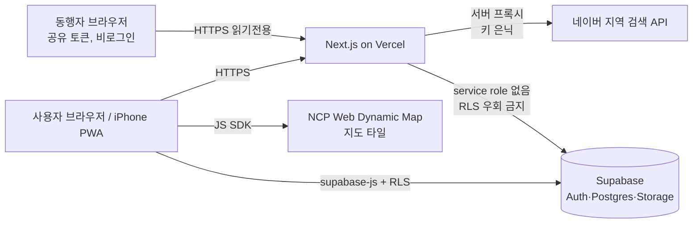
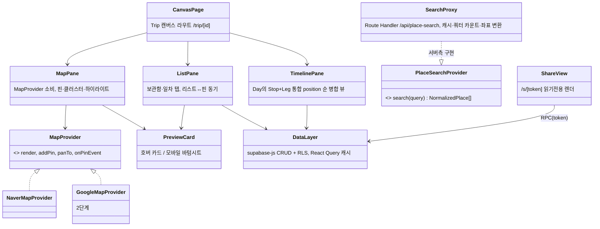
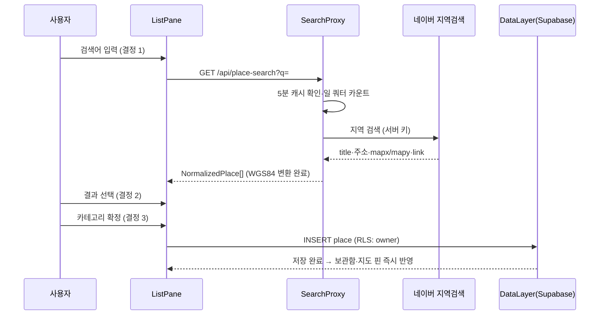
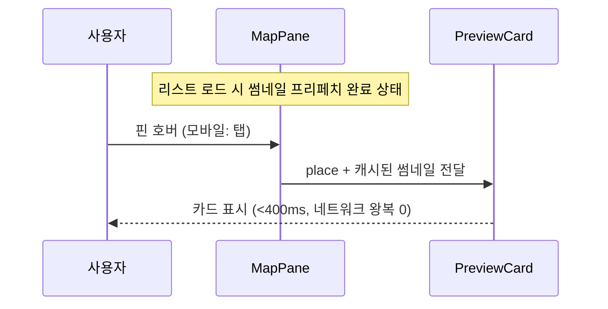
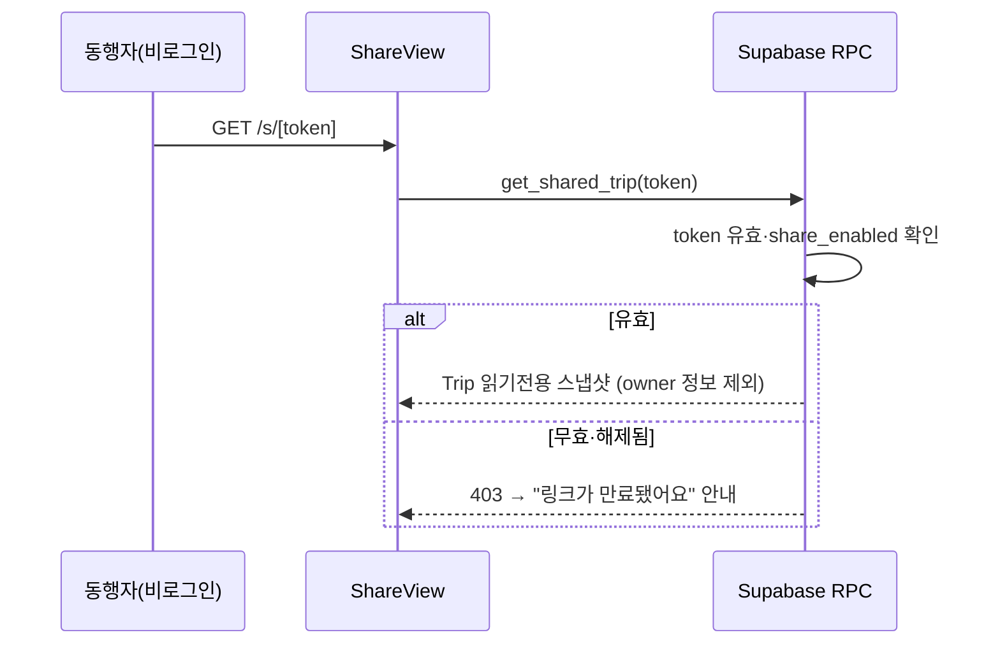
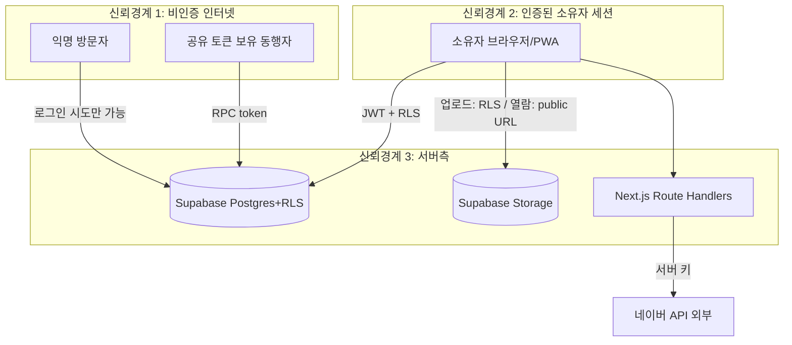

# 아키텍처 — Trip Canvas

작성 2026-08-06 · 입력: 03-prd, decision-log #1~#10

## Context & Scope

1인 개발·무료 티어 운영의 개인용 여행 기록 웹앱. 사용자 접점은 데스크톱 브라우저(계획)와 아이폰 PWA(여행 중 참조) 두 가지, 코드베이스는 하나. 외부 의존은 네이버 지역 검색 API(장소 데이터)·NCP Web Dynamic Map(지도 렌더링)·Supabase(데이터·인증·사진)·Vercel(호스팅). 기존 시스템 없음(그린필드).

## Goals / Non-goals

- Goals: PRD 목표 1~3 (마찰 없는 수집 · 한눈 파악 · 여행 중 즉답) + 지도 제공자 교체 가능성(결정 #2)
- Non-goals: PRD 범위 밖 1~7. 특히 실시간 협업 인프라·자체 서버 운영·멀티리전

## 설계

### 시스템 컨텍스트

### 구현 접근 (난점 → 선택)

| 난점 | 선택 | 이유 |
|---|---|---|
| 지도 제공자 교체(네이버→구글 병행) | `MapProvider` 인터페이스: `render(el)·addPin(place)·onPinHover/Tap·panTo` + `PlaceSearchProvider` 인터페이스: `search(query)→NormalizedPlace[]` | UI·데이터 계층이 제공자 타입을 모르게 격리. 좌표는 항상 WGS84 (결정 #6). 카카오 폴백도 같은 인터페이스 구현으로 흡수 |
| 네이버 API 키 보호·쿼터 관리 | 검색은 Next.js Route Handler 프록시 경유(키는 서버 env). 일 사용량 카운트·5분 캐시는 **SECURITY DEFINER RPC**(`record_search_usage`·`get_cached_search`)로 기록 — service role 키는 런타임에 존재하지 않음(07과 일치). 일 상한 12,500 도달 시 429 | 클라 키 노출 금지 + 쿼터 강제 지점 단일화 + "RLS 기본 deny" 아래서도 운영 테이블 쓰기 경로가 성립 (GATE C-1 해소) |
| iOS PWA 세션 격리 | 매직링크는 Safari에서 열려 설치형 PWA에 세션이 생기지 않는 함정 → 인증 메일에 6자리 OTP 코드 병행, PWA에서는 코드 입력이 기본 플로우 | 주 사용 시나리오(US-5 여행 중 참조)가 인증 불능이 되는 것을 차단 (GATE H-7 해소) |
| KATECH(mapx/mapy)→WGS84 | 프록시 응답 시점에 proj4 변환, DB에는 WGS84만 저장 | 이중 좌표계가 앱 내부로 새어들지 않게 경계에서 차단 |
| 호버 400ms (SC-002) | 썸네일(320px)을 리스트 로드 시 프리페치, 카드에는 썸네일만, 원본은 상세에서 lazy | 네트워크 왕복을 호버 경로에서 제거 |
| 권한 (소유자 쓰기 / 공유 읽기) | Supabase RLS 이중 정책: `owner_id = auth.uid()` 전권 + `share_token` 매칭 시 SELECT만. 공유 조회는 토큰을 파라미터로 받는 Postgres 함수(RPC) 경유 | 서버 코드가 아닌 DB 계층에서 강제 — 우회 경로 없음 |
| 오프라인 읽기 (SC-007) | Service Worker: 앱 셸 precache + 마지막 조회 Trip API 응답 stale-while-revalidate. 지도 타일은 캐시 제외(약관·용량) | iOS PWA 제약(background sync 없음) 내에서 성립하는 최소 설계 |

### 컴포넌트 구조

### 데이터 흐름 — 핵심 시나리오

**시나리오 1: 장소 검색·저장 (US-1, SC-001)**

**시나리오 2: 호버 미리보기 (US-2, SC-002)**

**시나리오 3: 공유 링크 조회 (US-4, SC-005)**

### 데이터 저장 (설계 결정 관련만 — 전체 스키마는 05)

- Postgres(Supabase): trips·days·places·stops·legs·photos 도메인 6테이블 + RLS. 좌표 `numeric(9,6)` WGS84. RPC 목록 — 트랜잭션 3종 `create_trip`·`update_trip_dates`·`reorder_day_items` / 공유 `enable_share`·`disable_share`·`get_shared_trip`(SECURITY DEFINER, 유일한 anon 허용, 내부 실패 카운터) / 운영 3종 `record_search_usage`·`store_search_cache`·`get_cached_search`(SECURITY DEFINER, authenticated 한정)
- Storage: 사진 버킷은 **public-read + 무작위 UUID 경로**(`photos/{uuid}/{uuid}.webp` — 경로에 식별정보 없음, 결정 #12). 쓰기만 RLS(소유자). 공유 뷰(비로그인)·오프라인 캐시·썸네일 프리페치가 서명 URL 만료 없이 성립 (GATE H-4 해소). 업로드 시 클라 리사이즈(원본 미보존, 결정 #5), 썸네일 320px 별도 생성
- 검색 캐시·쿼터 카운터: Vercel 함수는 무상태이므로 Postgres 테이블(`search_cache`, `api_usage`)에 SECURITY DEFINER RPC 경유로 기록(도메인 RLS와 분리, 직접 접근은 deny) — 별도 Redis 불요(개인 규모)

## 검토한 대안

| 대안 | 트레이드오프 | 기각 이유 |
|---|---|---|
| 카카오맵 MVP | 무료 쿼터 확실·국내 POI 강함 vs 사용자 습관(네이버 상세 링크) 불일치 | 사용자 명시 결정(#2). 단 MapProvider 구현 1개 거리의 폴백으로 유지 |
| 로컬 우선(IndexedDB)+동기화 | 오프라인 완전 지원 vs 공유 링크·다기기 동기화 복잡도 폭증 | 공유(US-4)가 P2 확정이라 서버 저장이 단순 (결정 #9) |
| 자체 Node 서버(Express)+VPS | 자유도 vs 운영·보안 패치 부담 | 1인 개발 제약 — 관리형(Vercel+Supabase)이 총비용 낮음 |
| 지도 타일 오프라인 캐시 | 여행 중 지도까지 오프라인 vs 타일 약관·용량 리스크 | 약관 위반 소지(01-recon 규제 표) — 리스트·타임라인 캐시로 충분(SC-007 허용 범위) |

## 위협모델

### ① 무엇을 만드는가 — DFD + trust boundary

### ② 무엇이 잘못될 수 있는가 — STRIDE (경계별 전수)

| 자산/경계 | S | T | R | I | D | E |
|---|---|---|---|---|---|---|
| 소유자 인증 (매직링크) | 이메일 계정 탈취 시 위장 가능 — **유효** | 링크 재사용 — Supabase 1회성·만료로 기본 차단 | 해당없음(단일 사용자 도구 — 부인 분쟁 주체 없음) | 매직링크 메일 노출 | 로그인 메일 폭탄 — Supabase rate limit | 해당없음(권한 단일 계층) |
| 공유 토큰 경로 | 토큰 추측 — **유효** | 읽기전용 RPC 밖 쓰기 시도 — **유효** | 해당없음(익명 열람 전제의 기능) | 유출 링크로 일정·위치 노출 — **유효(핵심)** | 토큰 무차별 대입 | 토큰으로 쓰기 권한 획득 시도 — **유효** |
| Postgres 데이터 | — (인증 경계에서 처리) | RLS 누락 테이블에 직접 쿼리 — **유효** | 해당없음 | RLS 정책 오류로 타 계정 열람 — **유효** | 무료 티어 용량 고갈 | RLS 우회 = I와 동일 경로 |
| Storage 사진 | — | 타인 경로 업로드 — **유효** | 해당없음 | 사진 URL 공개 추측 — **유효** | 대용량 업로드로 1GB 고갈 — **유효** | Storage 정책 오류 |
| 네이버 API 프록시 | 해당없음(우리→네이버 단방향, 키는 서버만) | 해당없음(응답 조작 유인 없음 — 읽기 데이터) | 해당없음 | 서버 키 유출(env·로그) — **유효** | 프록시 무한 호출로 쿼터 고갈 — **유효** | 해당없음 |

### ③ 무엇을 할 것인가

| 위협 | 대응 | 대책 |
|---|---|---|
| 이메일 탈취 → 계정 위장 | Accept(사유: 개인 도구, 이메일 보안은 사용자 영역. 데이터 민감도는 일정·위치 수준) | 세션 만료 기본값 유지, Supabase 대시보드에서 세션 폐기 가능 |
| 공유 토큰 추측·대입 | Mitigate | 토큰 = `gen_random_bytes(16)` 기반 128bit (UUID v4는 랜덤 122bit라 기준 미달 — 미사용), 토큰당 조회 rate limit, 실패는 E-11 RPC 내부에서 `api_usage` 카운터로 기록(알람 #4 계측 지점) |
| 공유 링크 유출 | Mitigate | 소유자 즉시 해제(FR-010, 해제 시 403 — SC-005), 공유 화면에 발급일 표시 |
| 토큰 경로 쓰기 시도 | Eliminate | 공유 접근은 SELECT 전용 RPC 하나로 한정 — 쓰기 함수 자체가 없음 |
| RLS 정책 오류 | Mitigate | 전 테이블 RLS 기본 deny + 정책 테스트를 A6 계약 테스트에 포함 (타 계정·무토큰 접근 403 자동 검증) |
| Storage 경로·URL 노출 | Mitigate + Accept | 버킷은 public-read이되 경로가 128bit 무작위·목록 API 차단(비열거) — URL 소지자만 열람 가능, 공유 토큰과 동일 신뢰 모델(결정 #12). 잔여(URL 재전달 시 노출)는 Accept(일정 공유와 동일 판단 영역) |
| 대용량 업로드 | Mitigate | 클라 리사이즈 + 서버측 파일 크기·MIME 제한(2MB), 사용량 07 모니터링 |
| 프록시 쿼터 고갈 (실수·악용) | Mitigate | 로그인 사용자만 검색 허용, 디바운스 300ms, 일 상한 도달 시 검색 차단+경보 (SC-008) |
| 서버 키 유출 | Mitigate | Vercel env 저장·코드 미포함, 로그에 키 미기록, 유출 시 네이버 콘솔 재발급 절차를 07 런북에 |

### ④ 충분한가 — 상위 리스크 재검토

1. **RLS 정책 오류** (개인 데이터 전체 노출 경로) — 정책 자동 테스트 + 신규 테이블 체크리스트로 잔여 위험 낮음. 잔여: Supabase 자체 취약점 → Transfer(관리형 서비스 SLA)
2. **공유 링크 유출** — 일정·위치가 노출되는 실질 피해. 즉시 해제 + 여행 종료 후 자동 해제 옵션(P2)로 완화. 잔여: 유출 인지 전 노출 — Accept(개인 판단 영역, 공유 화면에 주의 문구)
3. **네이버 무료 이용량 조건 미충족** (보안 아닌 사업 리스크) — MapProvider·PlaceSearchProvider 추상화로 카카오 전환 비용 = 구현체 1개. 가입 직후 콘솔 확인을 구현 0단계 태스크로 (08 핸드오프에 명시)

## Cross-cutting

- **관측성**: Vercel 함수 로그 + `api_usage` 테이블(검색 호출·Storage 용량 일별 집계)이 1차 계기판. 상세 07
- **프라이버시**: 여행 일정·위치는 민감 개인정보로 취급 — 기본 비공개, 공유는 명시적 opt-in, 로그에 좌표·주소 미기록(집계 수치만). 상세 07 로깅 전략
