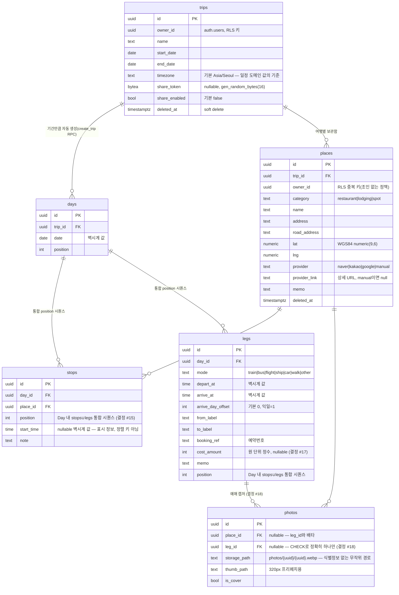

# API 계약 & 데이터 스키마 — Trip Canvas

작성 2026-08-06 · GATE 1차 반영 개정 · 입력: 03-prd FR, 04-architecture

아키텍처 특성상 API 표면은 3종: ① Next.js Route Handler(커스텀 로직), ② Supabase PostgREST(테이블 CRUD — **RLS 정책이 계약의 일부**), ③ Supabase RPC(트랜잭션·공유·운영 카운터). 셋 다 아래 공통 규약을 따른다.

## 규약 (전 표면 공통)

- 에러 포맷: Route Handler는 RFC 9457 Problem JSON (`type/title/status/detail/instance`), 스택트레이스 노출 금지 (Zalando #176·#177). PostgREST 에러는 DataLayer에서 동일 형태로 정규화해 UI에 전달
- 버저닝: URL 버저닝 회피(Zalando #115). 개인 도구이므로 무버전 시작, 파괴적 변경은 신규 경로 + 데이터 마이그레이션으로 처리(미디어타입 협상 불요 — YAGNI). DB 스키마는 마이그레이션 파일 순번
- 페이지네이션: 개인 규모라 기본 미적용. 유일한 목록 성장 지점인 장소 검색은 상위 5건 고정 — API 자체가 display 최대 5(NCP API HUB 지역검색 문서, 2026-08-06 확인)이고, 더보기 없음이 SC-001 결정 지점 최소화와도 일치
- 멱등성: 쓰기 레코드 PK = **클라이언트 생성 UUID** — 재시도 시 PK 충돌로 중복 생성 차단(Stripe Idempotency-Key와 동형, 헤더 대신 PK). 순서 변경은 Day 전체 순서 배열을 받는 `reorder_day_items` RPC(멱등·단일 트랜잭션)
- 시각 (GATE H-2 확정): **메타 타임스탬프**(`created_at`·`deleted_at` 등)는 UTC `timestamptz`. **일정 도메인 값**(`days.date`, `stops.start_time`, `legs.depart_at/arrive_at`)은 의도적으로 타임존 없는 벽시계 값 — 여행 일정의 진실은 현지 시각이다(`trips.timezone` 기준, 기본 Asia/Seoul). UTC 변환 저장 금지(KTX 09:00은 09:00으로 저장)
- 네이밍: 경로 kebab-case, 컬럼 snake_case

### 권한 모델 — 테이블별 RLS 정책 (GATE H-3 확정)

| 대상 | 정책 (전 테이블 기본 deny 위에) |
|---|---|
| `trips`, `places` | `owner_id = auth.uid()` 직접 비교 (places는 owner_id 중복 보유 — 조인 없는 정책) — SELECT/INSERT/UPDATE/DELETE 전권 |
| `days` | `EXISTS (SELECT 1 FROM trips t WHERE t.id = trip_id AND t.owner_id = auth.uid())` |
| `stops`, `legs` | `EXISTS (… days d JOIN trips t ON t.id = d.trip_id WHERE d.id = day_id AND t.owner_id = auth.uid())` 2단 조인 |
| `photos` | place 첨부: `EXISTS (… places p WHERE p.id = place_id AND p.owner_id = auth.uid())` / leg 첨부: legs→days→trips 3단 조인 소유 검증 (place_id·leg_id는 CHECK로 정확히 하나) |
| `search_cache`, `api_usage` | 직접 접근 전면 deny — SECURITY DEFINER RPC 3종(`record_search_usage`·`store_search_cache`·`get_cached_search`)만 접근하며, 이들의 EXECUTE는 **authenticated 롤 한정**(anon 호출 차단 — 카운터 조작·자기 DoS 방지). 공유 조회 실패 카운트는 별도 RPC가 아니라 `get_shared_trip` 내부에서 수행 (04 C-1 해소 경로) |
| RPC EXECUTE 정책 | `get_shared_trip`만 anon 허용(공유 뷰 전제 — 대신 rate limit+내부 실패 카운터), 그 외 전 RPC는 authenticated 한정 |
| Storage `photos` 버킷 | 읽기 public(무작위 128bit 경로·목록 API 차단 — 결정 #12) / 쓰기·삭제 `auth.uid()` 소유 places 경유 검증 |
| share-viewer | 테이블 접근 0 — `get_shared_trip(token)` SECURITY DEFINER RPC 하나만, SELECT 전용 |

## 엔드포인트 표

| ID | 메서드 경로 / 표면 | 요청(핵심) | 응답 | 주요 에러(RFC 9457 type) | 권한 |
|---|---|---|---|---|---|
| E-01 | Supabase Auth `signInWithOtp` | email | 매직링크 + 6자리 OTP 코드 동시 발송(메일 템플릿에 `{{ .Token }}` 포함), `verifyOtp`로 코드 인증 — PWA 기본 플로우 (FR-001) | `auth/rate-limited` | 공개 |
| E-02 | `POST rpc/create_trip` | id·name·start_date·end_date·timezone? | trip + 기간만큼 days 생성(단일 트랜잭션) | `validation/date-range` | owner |
| E-03 | `GET /api/place-search?q=` | q(2자 이상) | `NormalizedPlace[]` ≤5건. 업스트림 = NCP NAVER API HUB `GET /search/v1/local`(X-NCP-APIGW 헤더 — 정정 #19: 개발자센터 검색 API 신규 등록 불가) | `search/quota-exceeded`(일 12,500 도달 시 429 — SC-008)·`search/upstream-error`(502, 캐시 폴백 `cached[]` 동봉 — 단 현 RPC는 5분 내 캐시만 조회 가능, stale 제공은 `get_stale_search` 추가 후 성립: tasks T5-3·결정 #23)·`auth/required`(401)·`validation/query-too-short`(400)·`search/unavailable`(500 내부 오류, 원문 미노출) | owner |
| E-04 | `POST places` (PostgREST) | id·trip_id·category·name·**address·road_address·lat·lng·provider·provider_link**·memo (manual 등록은 provider=`manual`·provider_link null — FR-016) | place | `validation/coords`(WGS84 범위 밖)·`conflict/duplicate` | owner |
| E-05 | Storage `photos/{uuid}/{uuid}.webp` PUT + `POST photos` | 리사이즈된 WebP ≤2MB, 첨부 대상 = place_id 또는 leg_id(정확히 하나 — 결정 #18) | photo(storage_path·thumb_path·is_cover) | `storage/too-large`·`storage/bad-mime`·`validation/parent-exclusive` | owner |
| E-06 | `GET trips?id=eq.{id}&select=*,days(*,stops(*,place:places(*,photos(*))),legs(*)),places(*,photos(*))` (PostgREST 단일 쿼리) | trip id | **Trip Bundle** — 캔버스·타임라인·보관함 전체 (FR-005·006·011 데이터원, SW 오프라인 캐시 대상). places 임베드에 `deleted_at IS NULL` 필터 필수 — 삭제 Place의 핀·보관함 재등장 방지 (E-13의 places(count)도 동일) | `not-found` | owner |
| E-07 | Stop 배치·해제 = `PUT stops` 배열 upsert (PostgREST) / 혼합(Stop∪Leg) 순서 재정렬 = `POST rpc/reorder_day_items(day_id, ordered_ids[])` — 두 테이블 갱신을 단일 트랜잭션으로(부분 실패 없음) | day_id·[{id, place_id, position, start_time?}] 또는 ordered_ids | 갱신된 stops / 재정렬 결과 | `validation/position-dup` | owner |
| E-08 | `POST/PATCH/DELETE legs` (PostgREST) | mode·depart_at·arrive_at·arrive_day_offset·from_label·to_label·booking_ref·cost_amount·memo·position | leg | `validation/time-reversed`(offset 미지정 역전 — PRD 엣지)·`validation/cost-negative` | owner |
| E-09 | `PATCH places` (PostgREST) | memo 등 부분 갱신, `deleted_at=null`로 되돌리기(FR-017) | place | `not-found` | owner |
| E-10 | `POST rpc/enable_share` / `rpc/disable_share` | trip_id | share_token(`gen_random_bytes(16)`) / 해제 확인 | `not-found` | owner |
| E-11 | `GET rpc/get_shared_trip` | token | Trip Bundle 읽기전용 스냅샷(owner 식별정보 제외, 사진은 public URL이라 그대로 표시 가능 — 결정 #12) | `share/invalid-token`(403 — 해제·오타 구분 없음. 실패 시 RPC 내부에서 `api_usage` 카운터 증가 — 알람 #4) | share-viewer |
| E-12 | `DELETE`/`PATCH` 각 리소스 | id | **trips·places = soft delete**(`deleted_at` 기록, 90일 내 복구 — FR-017) / **stops·legs·photos = hard delete** | `not-found` | owner |
| E-13 | `GET trips?select=id,name,start_date,end_date,places(count)&deleted_at=is.null` | — | 여행 목록 (FR-014 홈 화면) | — | owner |
| E-14 | `POST rpc/update_trip_dates` | trip_id·start_date·end_date | Day 증감 + 삭제 Day의 Stop 제거 + 결과 카운트(`removed_stops`=제거 Stop 수, `unassigned_places`=이번 변경으로 어느 Day에도 남지 않게 되어 보관함으로 돌아간 Place 수) — 단일 트랜잭션 (FR-015) | `validation/date-range` | owner |

## OpenAPI 스케치 (핵심 커스텀 표면만 — 전문은 구현 단계)

```yaml
paths:
  /api/place-search:
    get:
      summary: 네이버 지역 검색 프록시 (캐시 5분·일 쿼터 12,500 강제·좌표 3형식→WGS84 정규화)
      parameters:
        - {name: q, in: query, required: true, schema: {type: string, minLength: 2}}
      responses:
        "200":
          content:
            application/json:
              schema:
                type: array
                maxItems: 5
                items:
                  type: object
                  required: [name, lat, lng, provider]
                  properties:
                    name: {type: string}          # HTML 태그 제거 완료 상태
                    address: {type: string}
                    roadAddress: {type: string}
                    lat: {type: number}           # WGS84
                    lng: {type: number}
                    categoryHint: {type: string}  # 네이버 category → restaurant/lodging/spot 매핑 제안
                    providerLink: {type: string, format: uri, nullable: true}
                    provider: {type: string, enum: [naver, kakao, google, manual]}
        "429": {$ref: "#/components/responses/Problem"}  # search/quota-exceeded
        "502": {$ref: "#/components/responses/Problem"}  # search/upstream-error + cached[] 동봉
```

## ERD



운영 보조 테이블(도메인 외, RPC 전용): `search_cache(query_hash, response, fetched_at)` · `api_usage(date, counter, count)` — 04 데이터 저장 절 참조.

## 데이터 규칙

- 좌표: WGS84 `numeric(9,6)`, KATECH은 E-03 경계에서만 존재 (결정 #6)
- 시각: 규약의 이원 규칙(메타=UTC timestamptz / 일정 도메인=벽시계+trips.timezone). `arrive_day_offset`으로 자정 초과 표현 (PRD 엣지)
- 순서 (결정 #15): Day 내 Stop·Leg는 **하나의 position 시퀀스를 공유** — 타임라인 순서의 유일 진실원. 시각 입력값은 정렬에 관여하지 않고, position과 역전 시 UI 경고 배지 (03-prd 엣지)
- 식별자: 전 테이블 클라 생성 UUID v4 (멱등성 규약 — PK 용도로는 122bit로 충분, 보안 토큰 용도로는 미사용)
- 삭제 (GATE M-1 단일화): trips·places만 soft delete(`deleted_at`) — 실수 복구 창구(FR-017), 90일 후 배치 파기(07). stops·legs·photos는 hard delete(`deleted_at` 컬럼 없음 — ERD와 일치)
- 중복 방지: `places`에 부분 유니크 인덱스 `(trip_id, name, lat, lng) WHERE deleted_at IS NULL` — `conflict/duplicate`의 강제 수단
- 사진: 원본 미보존 — 리사이즈본(≤2MB)+썸네일만. 경로는 무작위 UUID(결정 #12). 첨부 대상은 Place 또는 Leg(결정 #18)
- 금액: `cost_amount` = **원 단위 정수**(부동소수점·문자열 금지). MVP는 KRW 고정, 해외(2단계)에서 통화 필드 추가 예약 (결정 #17)
- Day 축소 시 Stop 처리는 E-14 트랜잭션 내에서만 수행 (부분 실패 없음)

## 커버리지 매핑 (P0·P1 100% 게이트)

| FR | 우선순위 | 담당 표면 |
|---|---|---|
| FR-001 | P0 | E-01 (매직링크+OTP) |
| FR-002 | P0 | E-02 (create_trip RPC) |
| FR-003 | P0 | E-03 + E-04 |
| FR-004 | P0 | E-05 |
| FR-005 | P0 | E-06 (데이터) + MapPane(표시) |
| FR-006 | P0 | E-06 썸네일 프리페치 + PreviewCard |
| FR-014 | P0 | E-13 |
| FR-007 | P0 | E-07 |
| FR-008 | P1 | E-08 + E-06(타임라인 데이터) |
| FR-009 | P1 | E-09 + places.provider_link |
| FR-015 | P1 | E-14 (update_trip_dates RPC) |
| FR-016 | P1 | E-04 (provider=manual, 좌표는 지도 이벤트) |
| FR-017 | P1 | E-12 (soft delete) + E-09 (`deleted_at=null` 복구) |
| FR-018 | P1 | E-05 (leg_id 첨부) + TimelinePane(표시) |
| FR-010 | P2 | E-10 + E-11 |
| FR-011 | P2 | E-06 + 클라 날짜 판정 |
| FR-012 | P2 | 서버 표면 없음 — SW가 E-06 캐시 (04 설계) |
| FR-013 | P2 | E-03/E-04 `provider` enum 선반영(kakao 폴백 포함 — RB-1), GoogleMapProvider 추가 시 활성 |

**P0·P1 매핑 0건 요구사항: 없음** (게이트 통과 — GATE 1차에서 FR-014~017 승격 후 재확인)
